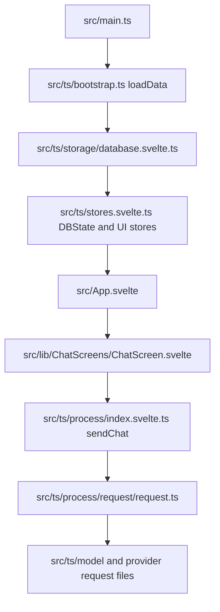

# Risuai Overview

## One-Line Summary

Risuai is a Svelte 5 + TypeScript application for multi-provider AI chat, with a large shared application state, rich chat processing logic, plugin extensibility, and optional Tauri desktop integrations.

## Stack

- Frontend: Svelte 5, TypeScript, Vite 7, Tailwind CSS 4
- Desktop: Tauri 2 with Rust commands
- Runtime patterns: global stores, direct conditional rendering, shared database object, feature-heavy processing pipeline
- Package manager: pnpm

Primary build and dev commands live in `package.json`.

## High-Level Shape

The runtime is centered around a single mounted app and a large shared database object.

## Main Entry Files

- `src/main.ts`
  Browser entrypoint. Mounts `App.svelte`, runs `preLoadCheck()`, `loadData()`, and hotkey init.
- `src/ts/bootstrap.ts`
  Application bootstrap. Loads save data, handles backups, loads plugins, sync, UI state updates, and post-load registration.
- `src/App.svelte`
  Top-level screen switcher. There is no traditional router. Main screen selection is based on global stores and DB state.

## Main Directories

### `src/lib`

Svelte UI components.

- `ChatScreens`: chat UI and related screen composition
- `Setting`: settings UI and wrappers
- `SideBars`: sidebar features like scripts and lorebook
- `Mobile`: mobile-specific layout pieces
- `UI`: reusable GUI widgets and Realm UI
- `Others`: modals, helpers, utility views
- `Playground`: internal testing/debug UI
- `LiteUI`: lightweight variant

### `src/ts`

Most application logic.

- `storage`: save format, database typing, persistence helpers
- `process`: chat orchestration, requests, memory, templates, MCP, tools, file handling
- `model`: provider model metadata and capability flags
- `plugins`: plugin loading, sandboxing, provider extension points
- `setting`: settings metadata and registry
- `parser`: prompt/message parsing and ChatML
- `drive`: account sync and backup integrations
- `translator`: translation backends
- `sync`: multi-user sync
- `gui`: color, animation, layout helpers

### `src-tauri`

Rust backend for desktop-only capabilities such as native requests, auth-related flows, and file-adjacent operations.

### `server`

Self-hosting server implementations.

- `server/node`: current Node/Express server
- `server/hono`: alternate Hono-based server path

## State Model

There are two major state classes:

1. UI/runtime stores in `src/ts/stores.svelte.ts`
2. Core application data in `DBState.db`

`DBState.db` is the real application source of truth for most features.

Important implications:

- A UI change often still needs DB schema awareness.
- A feature change often requires both state wiring and persistence compatibility.
- Many components read and mutate `DBState.db` directly or indirectly.

## Data Model

The most important types live in `src/ts/storage/database.svelte.ts`.

- `Database`
  Global app settings, provider keys, prompt config, themes, memory config, plugins, personas, and character list.
- `character`
  Single-character card definition, chats, scripts, TTS config, lore, assets, prompt overrides, modules, and metadata.
- `groupChat`
  Multi-character room definition with group-specific display and behavior fields.
- `Chat`
  Chat room state, messages, local lore, memory blobs, bookmarks, folder binding, and persona binding.
- `Message`
  Individual user/character chat entries plus metadata such as generation info and prompt info.

This file is a schema hub. If a feature introduces new persistent settings, this file is usually involved.

## Runtime Flow

### App Startup

`loadData()` in `src/ts/bootstrap.ts` does the following:

1. Detect environment: Tauri vs web
2. Load database from filesystem or browser storage
3. Recover from backups if needed
4. Load plugins
5. Load account/sync state
6. Update GUI/theme/runtime settings
7. Mark app as loaded and register post-load systems

### UI Flow

`src/App.svelte` decides which major screen to show:

- loading screen
- first setup
- settings
- mobile UI
- default desktop chat UI
- auxiliary popups and modals

There is no page router to guide you. The top-level app tree is controlled by state checks.

### Chat Flow

`sendChat()` in `src/ts/process/index.svelte.ts` is the main orchestration point.

Typical responsibilities include:

- current character/chat resolution
- prompt metadata preparation
- lorebook and memory integration
- group chat ordering
- scripting and triggers
- inlay/assets handling
- token accounting
- provider request dispatch
- post-processing, rerolls, TTS, and sync-related behavior

Provider dispatch then moves into `src/ts/process/request/request.ts`, which applies:

- plugin replacers
- request triggers
- fallback model logic
- provider-specific request handlers
- output cleanup and retry behavior

## Model and Provider Layer

`src/ts/model/modellist.ts` defines provider metadata and capability flags.

This metadata affects:

- formatting rules
- system prompt handling
- image/tool/thinking support
- tokenizer choice
- request parameter availability

Provider request code lives in `src/ts/process/request`.

If a model behaves oddly, you often need to inspect both the request file and the model metadata file.

## Extensibility Points

### Plugins

`src/ts/plugins/plugins.svelte.ts` is the main plugin import/load entry.

Plugins can affect:

- provider integration
- request pre/post replacement
- custom behavior hooks
- extra UI/action surfaces

### Modules

`src/ts/process/modules.ts` integrates module behavior into prompts, chats, and UI.

### MCP

`src/ts/process/mcp` adds tool and context protocol support.

### Memory Systems

`src/ts/process/memory` contains multiple memory implementations such as SupaMemory and HypaMemory variants.

Do not assume there is only one memory path.

## Platform Boundaries

### Web

- Uses local/browser-backed storage
- May use service worker behavior
- Supports hosted/self-hosted deployment patterns

### Tauri Desktop

- Uses app data filesystem paths
- Calls into Rust commands for some native behaviors
- Has separate desktop-only integration concerns

### Self-Hosted Server

- `server/node/server.cjs` is the current practical server path
- `server/hono` appears to be a newer or alternate direction

## Architectural Traits To Keep In Mind

- Large, centralized mutable state
- Feature-heavy core pipeline
- Many optional integrations
- Extension points embedded in runtime flow
- UI and logic often closely coupled

This means small feature changes can have wider blast radius than they first appear to.

## When You Start Exploring

Use this sequence:

1. Find the user-facing entry component
2. Find the store/DB field that drives it
3. Find where that field is loaded, saved, or transformed
4. Trace whether `process`, plugins, modules, or provider metadata are also involved

For task-specific entry points, continue in [llm-workmap.md](./llm-workmap.md).
